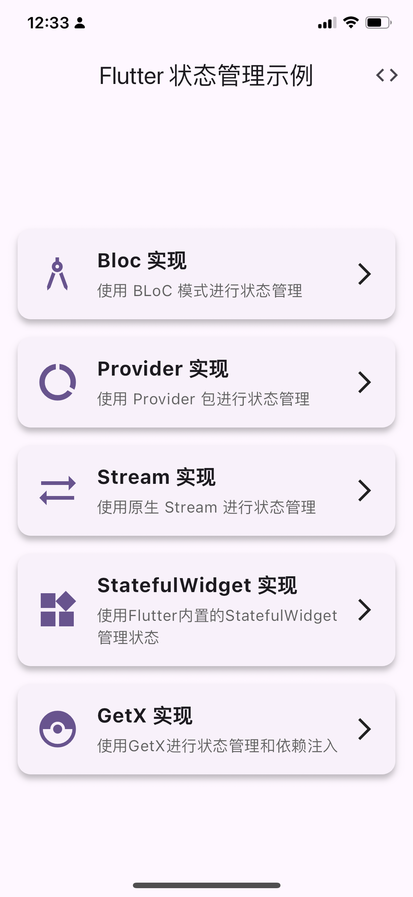

# Flutter 状态管理示例

本项目展示了Flutter中五种不同的状态管理实现方式，每种实现都创建了相同功能的计数器应用，以便于比较它们的异同。



## 项目结构

项目包含五个不同的状态管理实现：

- **Bloc**：使用BLoC模式实现的计数器
- **Provider**：使用Provider包实现的计数器  
- **Stream**：使用原生Dart Stream实现的计数器
- **StatefulWidget**：使用Flutter内置StatefulWidget实现的计数器
- **GetX**：使用GetX包实现的计数器

每个实现都在独立的目录中，拥有相似的代码结构和功能。

## 功能

所有计数器实现具有相同的功能：

- 显示当前计数值
- 增加计数按钮
- 减少计数按钮（不允许小于0）
- 重置计数按钮

此外，应用还提供了**源代码浏览器**功能，允许用户在运行时直接查看所有实现的源代码：

- 按类别组织的源代码文件结构
- 带有语法高亮的代码查看器
- 支持明暗两种主题切换
- 代码复制功能
- 适配多种编程语言的语法高亮
- **项目文档查看**：可以直接在应用内查看README和版本历史，支持标准Markdown渲染

## 各种状态管理方式比较

### Bloc

- **特点**：使用事件(Event)和状态(State)分离的模式
- **优势**：
  - 清晰的代码结构和数据流向
  - 适合复杂业务逻辑
  - 便于测试
- **实现文件**：
  - `lib/bloc/event.dart`：定义事件类型
  - `lib/bloc/state.dart`：定义状态结构
  - `lib/bloc/bloc.dart`：实现业务逻辑
  - `lib/bloc/view.dart`：UI实现

### Provider

- **特点**：基于InheritedWidget的状态管理解决方案
- **优势**：
  - 轻量级，API简单
  - 易于集成到现有项目
  - 良好的性能
- **实现文件**：
  - `lib/provider/provider.dart`：状态管理类
  - `lib/provider/view.dart`：UI实现

### Stream

- **特点**：使用Dart原生的Stream进行状态管理
- **优势**：
  - 无需额外依赖
  - 灵活性高
  - 适合事件驱动的应用
- **实现文件**：
  - `lib/stream/counter_stream.dart`：Stream控制器
  - `lib/stream/view.dart`：UI实现

### StatefulWidget

- **特点**：使用Flutter内置的状态管理方式
- **优势**：
  - 无需第三方库
  - 简单直观
  - 适合小型应用或组件
- **实现文件**：
  - `lib/stateful/counter_state.dart`：状态模型
  - `lib/stateful/view.dart`：StatefulWidget实现

### GetX

- **特点**：集状态管理、依赖注入、路由管理于一体的框架
- **优势**：
  - 简洁的代码
  - 高性能
  - 内置多种实用工具
  - 适合快速开发
- **实现文件**：
  - `lib/getx/controller.dart`：GetX控制器
  - `lib/getx/view.dart`：UI实现

## 选择合适的状态管理方式

选择状态管理方案时应考虑：

1. **项目规模**：
   - 小项目可以使用StatefulWidget或Provider
   - 大型复杂项目可以使用Bloc或GetX

2. **团队熟悉度**：
   - 根据团队熟悉的技术栈选择方案

3. **代码复杂度**：
   - Provider和GetX代码量较少
   - Bloc模式结构化更好，但代码量较大

4. **性能要求**：
   - 所有方案性能差异在大多数应用中不明显
   - 对极端性能要求，可能需要进行性能测试

## 运行项目

1. 确保已安装Flutter开发环境
2. 克隆本仓库
3. 执行 `flutter pub get` 安装依赖
4. 执行 `flutter run` 运行应用

## 环境

- Flutter: 3.22.0
- Dart: 3.4.0

## 版本信息

详细的版本更新内容请查看 [VERSION.MD](VERSION.MD) 文件。

当前版本: 1.0.0

## 源代码预览

### Bloc 模式

**event.dart**
```dart
abstract class CounterEvent {}

class InitEvent extends CounterEvent {}

class IncrementEvent extends CounterEvent {}

class DecrementEvent extends CounterEvent {}
```

**state.dart**
```dart
class CounterState {
  final int count;

  CounterState({this.count = 0});

  CounterState init() {
    return CounterState(count: 0);
  }

  CounterState copyWith({int? count}) {
    return CounterState(
      count: count ?? this.count,
    );
  }
}
```

**bloc.dart**
```dart
class CounterBloc extends Bloc<CounterEvent, CounterState> {
  CounterBloc() : super(CounterState().init()) {
    on<InitEvent>((event, emit) async {
      emit(await init());
    });
    
    on<IncrementEvent>((event, emit) {
      emit(state.copyWith(count: state.count + 1));
    });
    
    on<DecrementEvent>((event, emit) {
      if (state.count > 0) {
        emit(state.copyWith(count: state.count - 1));
      }
    });
  }

  Future<CounterState> init() async {
    return CounterState().clone();
  }
}
```

### Provider 模式

**provider.dart**
```dart
class CounterProvider extends ChangeNotifier {
  int _count = 0;
  
  int get count => _count;
  
  void increment() {
    _count++;
    notifyListeners();
  }
  
  void decrement() {
    if (_count > 0) {
      _count--;
      notifyListeners();
    }
  }
  
  void reset() {
    _count = 0;
    notifyListeners();
  }
}
```

### Stream 模式

**counter_stream.dart**
```dart
class CounterStream {
  final _counterController = StreamController<int>.broadcast();
  
  int _count = 0;
  
  Stream<int> get stream => _counterController.stream;
  
  int get count => _count;
  
  void increment() {
    _count++;
    _counterController.sink.add(_count);
  }
  
  void decrement() {
    if (_count > 0) {
      _count--;
      _counterController.sink.add(_count);
    }
  }
  
  void reset() {
    _count = 0;
    _counterController.sink.add(_count);
  }
  
  void dispose() {
    _counterController.close();
  }
}
```

### StatefulWidget 模式

**counter_state.dart**
```dart
class CounterState {
  final int count;

  const CounterState({this.count = 0});

  CounterState copyWith({int? count}) {
    return CounterState(
      count: count ?? this.count,
    );
  }
}
```

**view.dart (核心代码片段)**
```dart
class _StatefulCounterPageState extends State<StatefulCounterPage> {
  CounterState _state = const CounterState();

  void _increment() {
    setState(() {
      _state = _state.copyWith(count: _state.count + 1);
    });
  }

  void _decrement() {
    if (_state.count > 0) {
      setState(() {
        _state = _state.copyWith(count: _state.count - 1);
      });
    }
  }
}
```

### GetX 模式

**controller.dart**
```dart
class CounterController extends GetxController {
  final count = 0.obs;
  
  void increment() {
    count.value++;
  }
  
  void decrement() {
    if (count.value > 0) {
      count.value--;
    }
  }
  
  void reset() {
    count.value = 0;
  }
}
```

**view.dart (核心代码片段)**
```dart
class GetXCounterPage extends StatelessWidget {
  @override
  Widget build(BuildContext context) {
    final controller = Get.put(CounterController());

    return Scaffold(
      body: Center(
        child: Column(
          children: [
            // 使用Obx自动监听状态变化并重建UI
            Obx(
              () => Text(
                '${controller.count.value}',
                style: const TextStyle(fontSize: 48, fontWeight: FontWeight.bold),
              ),
            ),
            Row(
              children: [
                ElevatedButton(
                  onPressed: controller.decrement,
                  child: const Icon(Icons.remove),
                ),
                ElevatedButton(
                  onPressed: controller.increment,
                  child: const Icon(Icons.add),
                ),
              ],
            ),
          ],
        ),
      ),
    );
  }
}
```

## 依赖

- [bloc](https://pub.dev/packages/bloc): ^8.1.1
- [flutter_bloc](https://pub.dev/packages/flutter_bloc): ^8.1.1
- [provider](https://pub.dev/packages/provider): ^6.1.1
- [get](https://pub.dev/packages/get): ^4.6.6
- [flutter_highlight](https://pub.dev/packages/flutter_highlight): ^0.7.0
- [highlight](https://pub.dev/packages/highlight): ^0.7.0
- [flutter_markdown](https://pub.dev/packages/flutter_markdown): ^0.6.18

## 资源

### 官方文档

- [Flutter 官方文档](https://flutter.dev/docs)
- [Dart 官方文档](https://dart.dev/guides)

### 状态管理相关

- [Flutter Bloc 文档](https://bloclibrary.dev/)
- [Provider 文档](https://pub.dev/documentation/provider/latest/)
- [GetX 文档](https://pub.dev/documentation/get/latest/)
- [Flutter 官方状态管理指南](https://flutter.dev/docs/development/data-and-backend/state-mgmt/intro)

### 教程与文章

- [Flutter 状态管理终极指南](https://blog.logrocket.com/ultimate-guide-state-management-flutter/)
- [Flutter 中的响应式编程 (RxDart)](https://medium.com/flutter-community/reactive-programming-streams-bloc-6f0d2bd2d248)
- [Flutter 中的 MVVM 模式](https://medium.com/flutterdevs/mvvm-in-flutter-edd212fd767a)

### 视频资源

- [Flutter 中的 Bloc 模式](https://www.youtube.com/watch?v=oxj0RzcNp-Y)
- [Flutter 使用 Provider 进行状态管理](https://www.youtube.com/watch?v=pngZRJFPz3s)
- [Flutter 中的 GetX 状态管理](https://www.youtube.com/watch?v=wtHBdsF4rjU)
