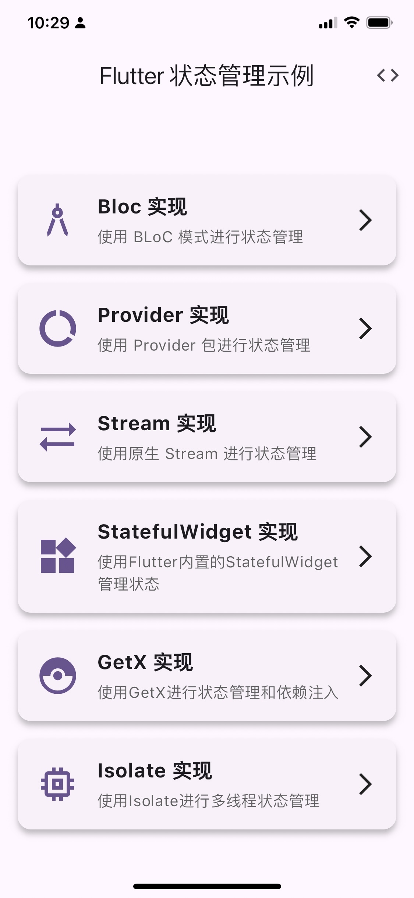
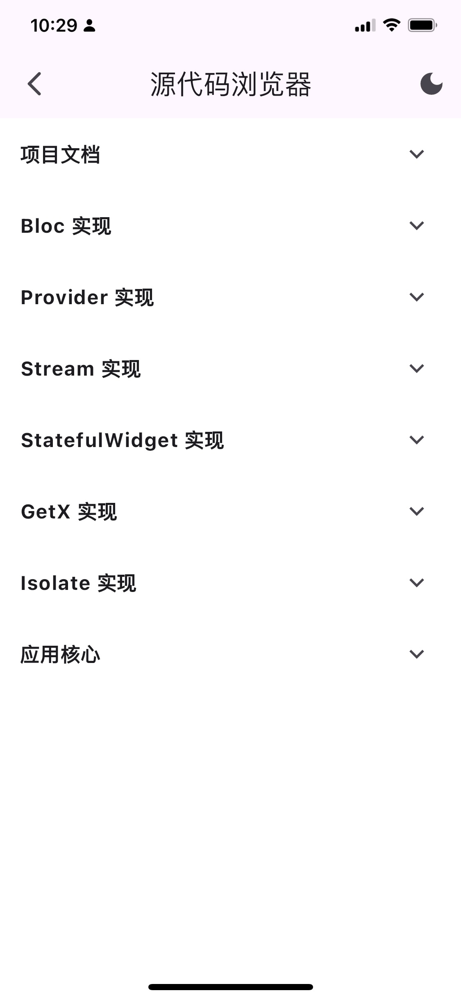
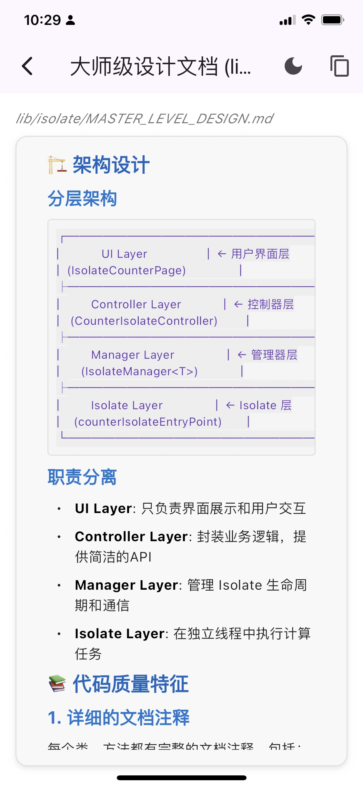

# Flutter 状态管理示例

本项目展示了Flutter中六种不同的状态管理实现方式，每种实现都创建了相同功能的计数器应用，以便于比较它们的异同。

## 项目结构

项目包含五个不同的状态管理实现：

- **Bloc**：使用BLoC模式实现的计数器
- **Provider**：使用Provider包实现的计数器  
- **Stream**：使用原生Dart Stream实现的计数器
- **StatefulWidget**：使用Flutter内置StatefulWidget实现的计数器
- **GetX**：使用GetX包实现的计数器
- **isolate**：使用isolate包实现的计数器

每个实现都在独立的目录中，拥有相似的代码结构和功能。

## 功能

### 计数器功能
所有计数器实现具有相同的功能：

### 源代码浏览器功能
- **文件浏览**：按类别组织的源代码文件结构
- **语法高亮**：支持多种编程语言的语法高亮显示
- **代码复制**：一键复制代码到剪贴板
- **文本转语音(TTS)**：
  - 支持朗读代码文件结构摘要（类、函数、注释统计等）
  - 支持朗读Markdown文档内容（自动去除Markdown标记）
  - 支持中文语音朗读
  - 可调节语速和音量
  - 支持一键停止朗读
  - 基于开源flutter_tts框架实现

此外，应用还提供了**源代码浏览器**功能，允许用户在运行时直接查看所有实现的源代码：

- 按类别组织的源代码文件结构
- 带有语法高亮的代码查看器
- 代码复制功能
- **文本转语音(TTS)朗读功能**：支持朗读代码文件结构和Markdown文档内容

- **项目文档查看**：可以直接在应用内查看README和版本历史，支持标准Markdown渲染

## 各种状态管理方式比较

### Bloc

- **特点**：使用事件(Event)和状态(State)分离的模式
- **优势**：
  - 清晰的代码结构和数据流向
  - 适合复杂业务逻辑
  - 便于测试
- **实现文件**：
  - `lib/bloc/event.dart`：定义事件类型
  - `lib/bloc/state.dart`：定义状态结构
  - `lib/bloc/bloc.dart`：实现业务逻辑
  - `lib/bloc/view.dart`：UI实现

### Provider

- **特点**：基于InheritedWidget的状态管理解决方案
- **优势**：
  - 轻量级，API简单
  - 易于集成到现有项目
  - 良好的性能
- **实现文件**：
  - `lib/provider/provider.dart`：状态管理类
  - `lib/provider/view.dart`：UI实现

### Stream

- **特点**：使用Dart原生的Stream进行状态管理
- **优势**：
  - 无需额外依赖
  - 灵活性高
  - 适合事件驱动的应用
- **实现文件**：
  - `lib/stream/counter_stream.dart`：Stream控制器
  - `lib/stream/view.dart`：UI实现

### StatefulWidget

- **特点**：使用Flutter内置的状态管理方式
- **优势**：
  - 无需第三方库
  - 简单直观
  - 适合小型应用或组件
- **实现文件**：
  - `lib/stateful/counter_state.dart`：状态模型
  - `lib/stateful/view.dart`：StatefulWidget实现

### GetX

- **特点**：集状态管理、依赖注入、路由管理于一体的框架
- **优势**：
  - 简洁的代码
  - 高性能
  - 内置多种实用工具
  - 适合快速开发
- **实现文件**：
  - `lib/getx/controller.dart`：GetX控制器
  - `lib/getx/view.dart`：UI实现

### isolate
- **特点**：并行
#### 性能优势

1. **并行处理**: 计数器逻辑在独立线程中运行，不会阻塞 UI
2. **内存隔离**: 每个 Isolate 有独立的内存空间，避免内存竞争
3. **错误隔离**: Isolate 中的错误不会影响主线程
4. **可扩展性**: 可以轻松创建多个 Isolate 处理不同任务

#### 适用场景

- 计算密集型任务
- 需要真正并行处理的场景
- 对性能要求极高的应用
- 需要错误隔离的关键任务

## 选择合适的状态管理方式

选择状态管理方案时应考虑：

1. **项目规模**：
   - 小项目可以使用StatefulWidget或Provider
   - 大型复杂项目可以使用Bloc或GetX

2. **团队熟悉度**：
   - 根据团队熟悉的技术栈选择方案

3. **代码复杂度**：
   - Provider和GetX代码量较少
   - Bloc模式结构化更好，但代码量较大

4. **性能要求**：
   - 所有方案性能差异在大多数应用中不明显
   - 对极端性能要求，可能需要进行性能测试

## TTS功能使用说明

### 功能特点
- **智能朗读**：根据文件类型自动选择朗读内容
  - 代码文件：朗读文件结构摘要（类、函数、注释统计等）
  - Markdown文件：朗读文档内容（自动去除Markdown标记）
- **语音设置**：支持中文语音，语速适中，音量可调
- **操作简便**：一键开始/停止朗读
- **错误处理**：完善的异常处理和用户提示

### 使用方法
1. 在源代码浏览器中打开任意文件
2. 点击右上角的"朗读全文"按钮（音量图标）
3. 朗读过程中可点击"停止"按钮（停止图标）中断朗读
4. 朗读完成后按钮自动恢复为"朗读全文"状态

### 技术实现
- 基于开源flutter_tts框架
- 支持Android和iOS平台
- 自动处理TTS生命周期和资源释放
- 智能文本预处理，提升朗读体验

## 运行项目

1. 确保已安装Flutter开发环境
2. 克隆本仓库
3. 执行 `flutter pub get` 安装依赖
4. 执行 `flutter run` 运行应用

## 环境

- Flutter: 3.22.0+
- Dart: 3.4.0

## 版本信息

详细的版本更新内容请查看 [VERSION.MD](VERSION.MD) 文件。

当前版本: 1.0.0

## 源代码预览

## 依赖

- [bloc](https://pub.dev/packages/bloc): ^8.1.1
- [flutter_bloc](https://pub.dev/packages/flutter_bloc): ^8.1.1
- [provider](https://pub.dev/packages/provider): ^6.1.1
- [get](https://pub.dev/packages/get): ^4.6.6
- [flutter_highlight](https://pub.dev/packages/flutter_highlight): ^0.7.0
- [highlight](https://pub.dev/packages/highlight): ^0.7.0
- [flutter_markdown](https://pub.dev/packages/flutter_markdown): ^0.6.18
- [flutter_tts](https://pub.dev/packages/flutter_tts): ^3.8.5 - 文本转语音功能

## 资源

### 官方文档

- [Flutter 官方文档](https://flutter.dev/docs)
- [Dart 官方文档](https://dart.dev/guides)

### 状态管理相关

- [Flutter Bloc 文档](https://bloclibrary.dev/)
- [Provider 文档](https://pub.dev/documentation/provider/latest/)
- [GetX 文档](https://pub.dev/documentation/get/latest/)
- [Flutter 官方状态管理指南](https://flutter.dev/docs/development/data-and-backend/state-mgmt/intro)

### 教程与文章

- [Flutter 状态管理终极指南](https://blog.logrocket.com/ultimate-guide-state-management-flutter/)
- [Flutter 中的响应式编程 (RxDart)](https://medium.com/flutter-community/reactive-programming-streams-bloc-6f0d2bd2d248)
- [Flutter 中的 MVVM 模式](https://medium.com/flutterdevs/mvvm-in-flutter-edd212fd767a)

### 视频资源

- [Flutter 中的 Bloc 模式](https://www.youtube.com/watch?v=oxj0RzcNp-Y)
- [Flutter 使用 Provider 进行状态管理](https://www.youtube.com/watch?v=pngZRJFPz3s)
- [Flutter 中的 GetX 状态管理](https://www.youtube.com/watch?v=wtHBdsF4rjU)
